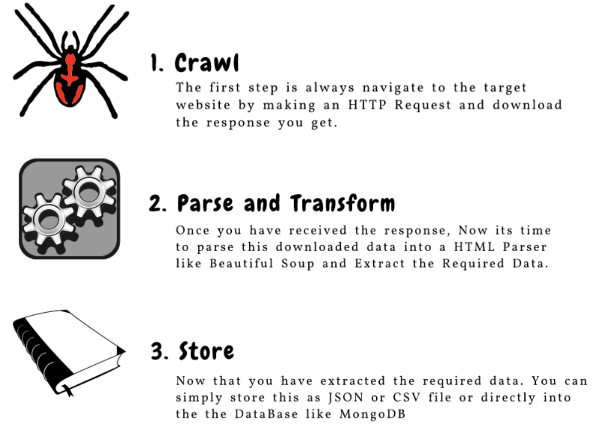
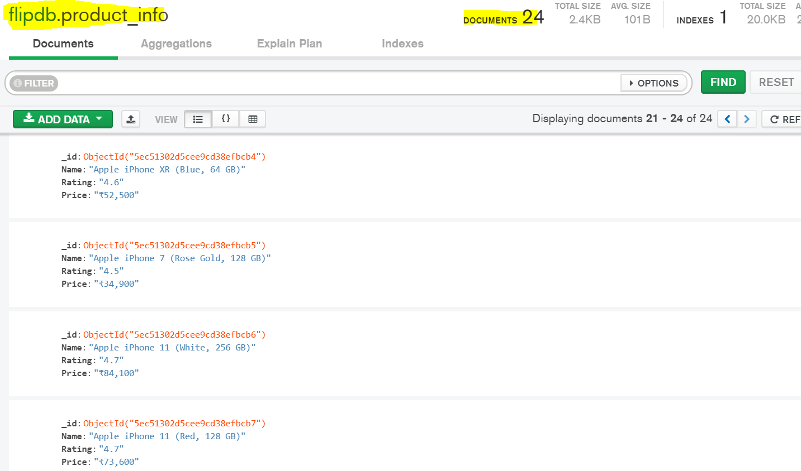

# Flipkart_MongoDB_Webscrapper
Web Scraping is a technique employed to extract large amounts of data from websites whereby the data is extracted and saved to a local file in your computer or to a database like MongoDB.

The three main components of web scraping are :

In this project, I have scrapped the Flipkart E-commerce website product name, product prices, rating. All the scrapped data from the flipkart website is stored in MongoDB. From the MongoDB, we can export all the stored data into excel, csv file formats. I have used Python, BeautifulSoup and Requests to scrap the product prices, product name and ratings from the website. BeautifulSoup enables us to extract data and parse  HTML and XML documents.

MongoDB data storage :

Below are the tools and libraries used to extract the data from website:

1. Language  : Python
2. Libraries : BeautifulSoup, Requests
3. Database  : MongoDB
